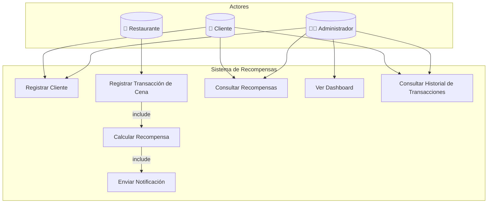
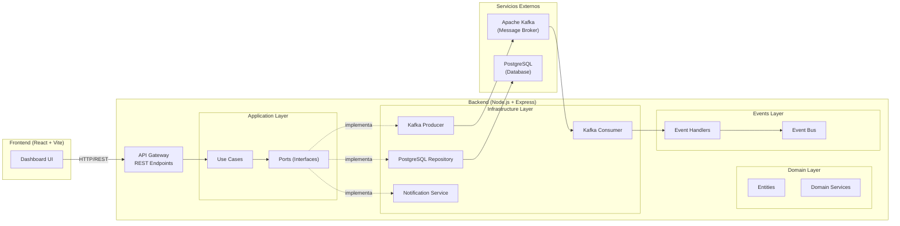
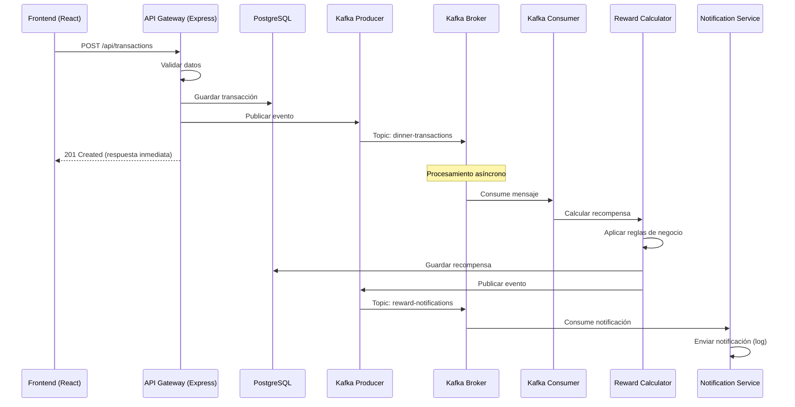

# Arquitectura del Sistema de Recompensas para Restaurantes

## 1. Descripción General

El **Sistema de Recompensas para Restaurantes** es una aplicación que permite a clientes acumular puntos y cashback por sus consumos en restaurantes afiliados. El sistema utiliza una **Arquitectura Orientada a Eventos (Event-Driven Architecture - EDA)** con **Apache Kafka** como broker de mensajería, garantizando desacoplamiento, escalabilidad y procesamiento en tiempo real.

## 2. Patrón Arquitectónico: Event-Driven Architecture (EDA)

### ¿Por qué EDA?

La EDA fue seleccionada porque:
- **Desacoplamiento**: Los servicios productores y consumidores no se conocen entre sí
- **Escalabilidad**: Cada consumidor puede escalar independientemente
- **Resiliencia**: Si un servicio falla, los mensajes persisten en Kafka
- **Procesamiento asíncrono**: Las recompensas se calculan sin bloquear la respuesta al usuario

### Principios de Diseño Aplicados

| Principio | Implementación |
|---|---|
| **Alta Cohesión** | Cada módulo tiene una responsabilidad clara (Domain, Application, Infrastructure) |
| **Bajo Acoplamiento** | Los use cases dependen de interfaces (ports), no de implementaciones concretas |
| **Modularidad** | Separación en capas independientes con contratos bien definidos |
| **Escalabilidad** | Kafka permite agregar consumidores sin modificar productores |

## 3. Diagrama de Casos de Uso



## 4. Diagrama de Arquitectura



## 5. Flujo de Eventos

### Flujo Principal: Procesamiento de Transacción



## 6. Topics de Kafka

| Topic | Productor | Consumidor | Descripción |
|---|---|---|---|
| `dinner-transactions` | API Gateway | Rewards Service | Transacciones de cena registradas |
| `rewards-calculated` | Rewards Service | — | Recompensas calculadas (auditoría) |
| `reward-notifications` | Rewards Service | Notification Service | Notificaciones de recompensa |

## 7. Estructura de Mensajes

### dinner-transactions
```json
{
  "transactionId": "uuid",
  "customerId": 1,
  "cardNumber": "4532-XXXX-XXXX-1234",
  "restaurantCode": "REST001",
  "amount": 150.00,
  "description": "Cena familiar",
  "timestamp": "2026-05-30T20:00:00Z"
}
```

### reward-notifications
```json
{
  "rewardId": "uuid",
  "customerId": 1,
  "transactionId": "uuid",
  "points": 450,
  "cashback": 7.50,
  "message": "¡Has ganado 450 puntos y S/ 7.50 de cashback!",
  "timestamp": "2026-05-30T20:00:01Z"
}
```

## 8. Reglas de Negocio - Cálculo de Recompensas

| Monto Consumido | Puntos por S/1 | Cashback |
|---|---|---|
| S/ 0 – S/ 50 | 1 punto | 2% |
| S/ 50.01 – S/ 150 | 2 puntos | 3% |
| Más de S/ 150 | 3 puntos | 5% |

**Ejemplo**: Jesús consume S/ 200 en un restaurante:
- Puntos: 200 × 3 = **600 puntos**
- Cashback: 200 × 5% = **S/ 10.00**

## 9. Tecnologías Utilizadas

| Componente | Tecnología | Versión |
|---|---|---|
| Frontend | React + Vite | 18.x |
| Backend | Node.js + Express | 20.x LTS |
| Message Broker | Apache Kafka (KRaft) | 4.x |
| Base de Datos | PostgreSQL | 16 |
| Kafka Client | KafkaJS | 2.x |
| Testing | Jest | 29.x |
| Containerización | Docker + Docker Compose | Latest |
| Análisis de Código | SonarCloud | — |

## 10. Cómo Ejecutar

```bash
# 1. Levantar infraestructura (Kafka + PostgreSQL)
docker-compose up -d

# 2. Instalar dependencias del backend
cd backend && npm install

# 3. Iniciar backend
npm run dev

# 4. Instalar dependencias del frontend (en otra terminal)
cd frontend && npm install

# 5. Iniciar frontend
npm run dev

# 6. Acceder al dashboard
# Frontend: http://localhost:5173
# Kafka UI: http://localhost:8080
```
